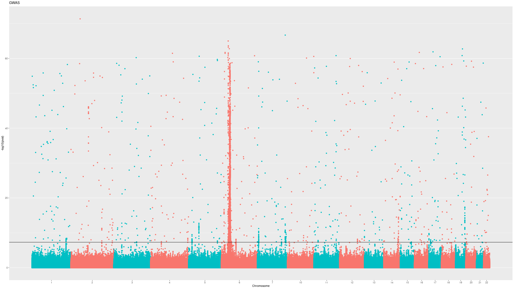

# Requirements
Required Python version:
> Python v3.6.8 

Required Python modules:
> numpy v1.15.4  
> subprocess  
> json  
> os  
> collections  
> matplotlib v3.0.2  
> scipy v1.2.1  
> king v2.2.4  

# Introduction 
A Genome Wide Association Study or GWAS aims to study the potential association of Single Nucleotide Polymorphisims (SNP or variant) with a specific disease by leveraging statistical methods and comparing healthy controls with affected cases. 

This repository attempts to standardize GWASs of HLA-related diseases by providing a structured and traceable pipeline with a *settings* based logic. 

# Pipeline

The pipeline is composed by the following steps, in order of apperance: Binarization of `.ped` files, Merge, Quality Control, Principal Component Analysis, Case-Control Matching, and Logistic Regression Computation.

### Binarization
The first step taken by the pipeline is the binarization of `.ped` files utilizing `PLINK` - that is, converting `.ped` to `.bed`. This step can be skiped by providing binarized files directly to the pipeline.

### Merge
The pipeline allows the input of multiple datasets, by mergeing them with their common SNPs. This step is skipped if only one dataset is provided. 

### Quality Control 
Quality Control (QC) filters out duplicated, and triplicated variants, and variants with los Minimum Allele Frequency (MAF) as provided in the `settings.json` file. Duplicated subjects based on FID and IID, ans subjects with high missingness of genotype as specified in `settings.json` are also removed. 

### Principal Component Analysis
Principal Component Analysis (PCA) is a dimensionality reduction operation that provides directions(Principal Components, PCs) of maximum variability (usually due to batches and/or ethnicity). It will be used to verify the lack of biases to due differences in bathces, and in the subsequent case-control matching step. 

### Case-Control Matching 
To improve statistical power and significance validity, cases are *matched* to a number of controls as provided in `settings.json`. Matching process takes each case's PCs and computes the Euclidian distance with all controls, selecting the closest ones - that is, the more genetically similar controls are selected, therefore reducing variability within cases.

### Logistic regression
A logistic regression is fit for each variant, controlling for PCs and therefore accounting for variability between case-control matching groups.

## Additional functions
Two additional functions have been included as part of the pipeline, although they do not form part of a GWAS.

### `manhattanPlot.R`
Computes a Manhattan Plot to visualize significant variants and/or genome regions of interest.

### `HLA_imputation.R`
Utilizes HLA Genotype Imputation with Attribute Bagging (HIBAG) to impute the HLA types through `.bed` files - in this case, the QCed files. *Note:* a trained [HIBAG](https://bioconductor.org/packages/release/bioc/html/HIBAG.html) model is necessary to run this function - if none available, please contact [Aditya Ambassi](https://github.com/adiamb).

### `submit_slurm.sh`
Submits the pipeline to a SLURM-based computing platform. Requires modification of header.

# Usage 
To run the pipeline, please follow these this steps:
1. Clone the repository.
2. Fill up the `setting.json` file (refer to Settings section).
3. Copy `.ped` files / `.bed` files to directory.
4. Run `python run_GWAS.py` from the directory of the pipeline.

## Settings
This pipeline runs on a *settings*-based logic, and therefore all paths and constants are stored in `settings.json`. To correctly run the pipeline, please fill up/modify the following sections of `settings.json`, and leave the rest unmodified.
* ***directory***
  * *GWAS*: Relateive/Full path to folder containing `.ped` files.
  * *GWAS_binaries*: Relateive/Full path to folder containing `.bed` files.
  * *HLA_Imputation*: Relateive/Full path to folder containing HLA imputation outputs (only for `HLA_imputation.R`)
  * *GWAS_out*: Relateive/Full path to folder contaning GWAS logistic regression output.
* ***plinkFiles***
  * *prefix*: Prefix used to name files after merged.
  * *GWAS*: Relateive/Full path to folder containing merged files.
  * *GWASQC*: Relateive/Full path to folder containing QCed files.
* ***IBD_threshold***: Threshold to remove subjects based on IBD.
* ***phenomiss***: Threshold to remove subjects based on missing phenotype.
* ***genomiss***: Threshold to remove subjects based on missing genotype.
* ***maf***: Minimum Allele Frequency threshold.
* ***ControlCaseRatio***: Number of controls per case to match.

## Warnings
The relative or full paths in `settings.json` must end with a slash ("/") to allow correct functionment of the pipeline.

# Future work
- [ ] Remove content of folders in each iteration automatically?
- [X] PCA cannot be performed if "," are in the SNPS ids.
- [ ] Does not support flip in merge, maybe remove merge until robust.